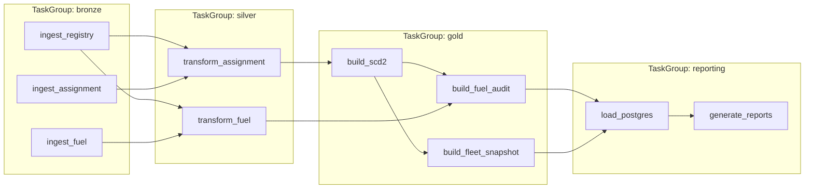
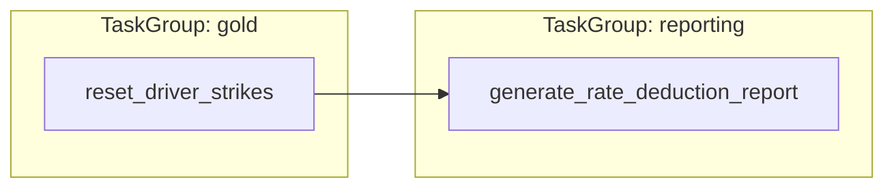
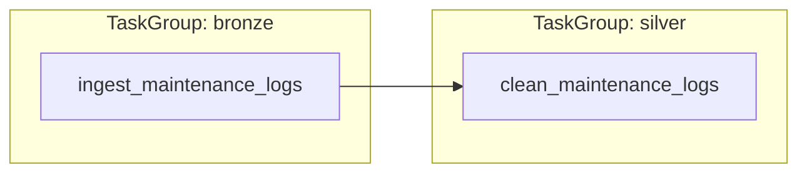
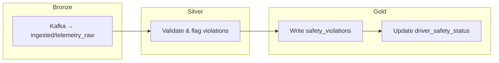

# OmniRoute — Airflow DAG Documentation

DAGs are organized by **schedule frequency**, with **TaskGroups** inside each DAG to represent layer boundaries (Bronze → Silver → Gold → Reporting).

## DAG Overview

| DAG | Schedule (cron) | Layers | Description |
|---|---|---|---|
| `omniroute_daily_batch` | `0 5 * * *` (daily 05:00 UTC) | Bronze → Silver → Gold → Reporting | Core pipeline: ingest registry, assignment, fuel → transform → SCD2, fuel audit, fleet snapshot → load Postgres → generate reports |
| `omniroute_monthly_cooldown` | `0 5 1 * *` (1st of month 05:00 UTC) | Gold → Reporting | Reset strikes for eligible drivers, generate rate deduction report |
| `omniroute_yearly_maintenance` | `0 0 1 1 *` (Jan 1st 00:00 UTC) | Bronze → Silver | Ingest maintenance_schedules.csv, clean and deduplicate |
| `omniroute_streaming` | Externally managed (always-on) | Bronze → Silver → Gold | Kafka telemetry → validate → detect violations → update driver safety |

---

## 1. `omniroute_daily_batch`

```
Schedule: 0 5 * * * (daily @ 05:00 UTC)
Catchup:  False
Tags:     [batch, daily, core]
```

### Task Dependency Chain



### Task Details

| TaskGroup | Task | Spark Job | Description |
|---|---|---|---|
| bronze | `ingest_vehicle_registry` | `batch/ingest_vehicle_registry.py` | Full snapshot CSV → Parquet (overwrite) |
| bronze | `ingest_vehicle_assignment` | `batch/ingest_vehicle_assignment.py` | Incremental CSV → Parquet (append) |
| bronze | `ingest_fuel_transactions` | `batch/ingest_fuel_transactions.py` | Daily fuel CSV → Parquet (append) |
| silver | `transform_vehicle_assignment` | `batch/transform_vehicle_assignment.py` | Unix→date, dedup by highest rate |
| silver | `transform_fuel_transactions` | `batch/transform_fuel_transactions.py` | Weekend/maintenance filter, compute km/liter |
| gold | `build_asset_history_scd2` | `batch/build_asset_history_scd2.py` | SCD Type 2 merge |
| gold | `build_fuel_efficiency_audit` | `batch/build_fuel_efficiency_audit.py` | 12% threshold audit |
| gold | `build_active_fleet_snapshot` | `batch/build_active_fleet_snapshot.py` | IN-TRANSIT count by model |
| reporting | `load_reporting_db` | `batch/load_reporting_db.py` | Gold → PostgreSQL via JDBC |
| reporting | `generate_reports` | `batch/generate_reports.py` | CSV/TXT exports to S3 |

---

## 2. `omniroute_monthly_cooldown`

```
Schedule: 0 5 1 * * (1st of month @ 05:00 UTC)
Catchup:  False
Tags:     [batch, monthly, safety]
```

### Tasks



### Logic

- Reset `strike_count = 0` and `current_adjusted_rate = base_rate` for drivers `WHERE status != 'SUSPENDED'`
- Generate monthly rate deduction TXT report to S3
- Idempotent: uses `last_reset_month` to prevent double resets on retry

---

## 3. `omniroute_yearly_maintenance`

```
Schedule: 0 0 1 1 * (Jan 1st @ 00:00 UTC)
Catchup:  False
Tags:     [batch, yearly, maintenance]
```

### Tasks



### Logic

- Ingest `maintenance_schedules.csv` from `landing/` → validate → write to `ingested/maintenance_schedules/`
- Deduplicate by `(vin, service_date)` → write to Silver
- No Gold/Reporting step — maintenance data is a lookup table consumed by the daily fuel audit

---

## 4. `omniroute_streaming`

```
Schedule: Externally managed (always-on Spark Streaming job)
Tags:     [streaming, safety, real-time]
```

### Pipeline



### Logic

- Spark Structured Streaming reads Avro from Kafka
- Validates events, flags speeding (`> 110 km/h`) and restricted zone breaches
- Joins with `gold.asset_history_scd2` to resolve `driver_id` from `vin`
- Appends violations and updates driver safety status in near-real-time

---

## Configuration

| Parameter | Value | Source |
|---|---|---|
| `SPARK_SUBMIT` | `spark-submit` | DAG file |
| `JOBS_DIR` | `/opt/omniroute/spark_jobs` | DAG file |
| `RUN_DATE` | `{{ ds }}` (Airflow execution date) | Airflow template |
| Retries | 2 | `default_args` |
| Retry delay | 5 minutes | `default_args` |
| Max active runs | 1 | DAG config |
