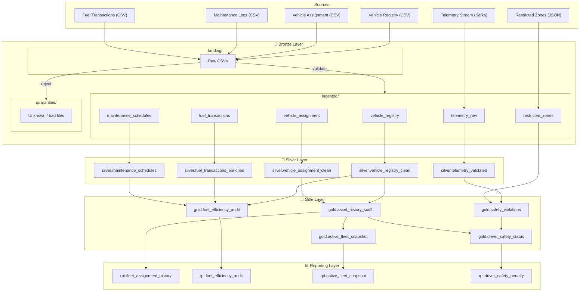
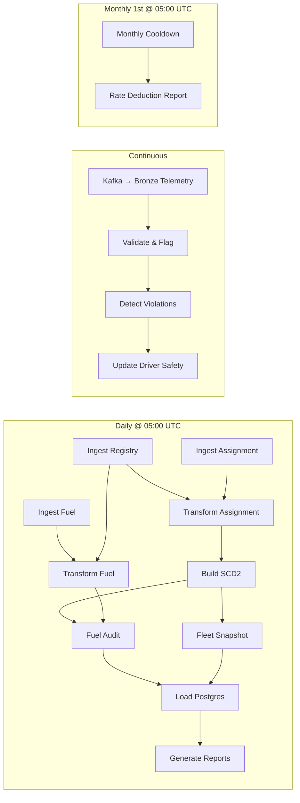

# OmniRoute — Medallion Architecture Design

## Architecture Overview

```
                    ┌─────────────────────────────────────────────────────┐
                    │                   DATA SOURCES                     │
                    │                                                     │
                    │  S3 (CSV)                     Kafka (JSON)          │
                    │  ┌──────────────────┐         ┌──────────────────┐  │
                    │  │ Vehicle Registry │         │ Telemetry Stream │  │
                    │  │ Vehicle Assign.  │         └──────────────────┘  │
                    │  │ Maintenance Logs │                               │
                    │  │ Fuel Txns        │         S3 (JSON)             │
                    │  └──────────────────┘         ┌──────────────────┐  │
                    │                               │ Restricted Zones │  │
                    │                               └──────────────────┘  │
                    └──────────────┬────────────────────────┬─────────────┘
                                  │                        │
                    ══════════════╪════════════════════════╪═════════════
                                  ▼                        ▼
                    ┌─────────────────────────────────────────────────────┐
                    │               🥉 BRONZE LAYER                      │
                    │         s3://omniroute-bronze/                      │
                    │                                                     │
                    │  landing/    → raw CSVs dropped by upstream         │
                    │  ingested/   → validated & converted to Parquet     │
                    │  quarantine/ → unknown files or bad formats         │
                    │                                                     │
                    │  Flow: landing → validate → ingested (or quarantine)│
                    │  Source CSVs deleted from landing after ingestion   │
                    └──────────────────────────┬──────────────────────────┘
                                               │
                    ══════════════════════════╪═══════════════════════════
                                               ▼
                    ┌─────────────────────────────────────────────────────┐
                    │              🥈 SILVER LAYER (Cleansed)            │
                    │         s3://omniroute-data-lake/silver/            │
                    │                                                     │
                    │  Deduplication, type casting, timestamp conversion  │
                    │  Weekend/maintenance filtering for fuel data        │
                    │  Derived columns (distance_km, km_per_liter)       │
                    └──────────────────────────┬──────────────────────────┘
                                               │
                    ═══════════════════════════╪══════════════════════════
                                               ▼
                    ┌─────────────────────────────────────────────────────┐
                    │               🥇 GOLD LAYER (Business)            │
                    │         s3://omniroute-data-lake/gold/              │
                    │                                                     │
                    │  SCD Type 2 asset history                          │
                    │  Fuel efficiency audit (flagged / OK)              │
                    │  Active fleet snapshot                             │
                    │  Driver safety & penalty status                    │
                    │  Safety violations log                             │
                    └──────────────────────────┬──────────────────────────┘
                                               │
                    ═══════════════════════════╪══════════════════════════
                                               ▼
                    ┌─────────────────────────────────────────────────────┐
                    │            📊 REPORTING LAYER                      │
                    │         PostgreSQL (RDS / EC2)                      │
                    │                                                     │
                    │  Report-ready tables for BI & ad-hoc SQL           │
                    │  Scheduled TXT/CSV exports to S3                   │
                    └─────────────────────────────────────────────────────┘
```

---

## Data Flow Diagram



---

## 🥉 Bronze Layer

**Bucket:** `s3://omniroute-bronze/`  
**Format:** CSV (landing) → Parquet (ingested)  
**Principle:** Validate and convert source data. No business logic, no dedup, no schema changes.

### Bronze Folder Structure

| Folder | Purpose | Contents |
|---|---|---|
| `landing/` | Drop zone for raw source CSVs | Upstream systems upload files here |
| `ingested/` | Validated data converted to Parquet | Partitioned by `dt=YYYY-MM-DD` |
| `quarantine/` | Rejected files | Unknown filenames, unexpected formats, corrupt files |

### Bronze Ingestion Flow

```
landing/*.csv  →  Ingestion Job  →  ingested/<table>/dt=YYYY-MM-DD/  (success)
                       │
                       └──────────→  quarantine/dt=YYYY-MM-DD/       (failure)

                  On success: DELETE source CSV from landing/
```

**Validation checks before ingestion:**
1. Is the filename recognized? (vehicle_registry, vehicle_assignment, etc.)
2. Is the file format CSV?
3. Does the schema match the expected columns?
4. If any check fails → move file to `quarantine/`

> [!NOTE]
> Kafka telemetry bypasses `landing/` entirely — it streams directly into `ingested/telemetry_raw/`.

### ingested/vehicle_registry

| Column | Type | Source |
|---|---|---|
| `vin` | STRING | vehicle_registry.csv |
| `model` | STRING | vehicle_registry.csv |
| `mfg_year` | INT | vehicle_registry.csv |
| `fuel_type` | STRING | vehicle_registry.csv |

- **Ingestion:** Daily full snapshot → `mode=overwrite`
- **Partition:** `dt` (ingestion date)

---

### ingested/vehicle_assignment

| Column | Type | Source |
|---|---|---|
| `vin` | STRING | vehicle_assignment.csv |
| `driver_id` | STRING | vehicle_assignment.csv |
| `start_timestamp` | LONG | Unix epoch from source |
| `end_timestamp` | LONG / NULL | Unix epoch or NULL |
| `daily_rate` | FLOAT | vehicle_assignment.csv |
| `region` | STRING | vehicle_assignment.csv |

- **Ingestion:** Daily incremental → `mode=append`
- **Partition:** `dt` (ingestion date)

---

### ingested/maintenance_schedules

| Column | Type | Source |
|---|---|---|
| `vin` | STRING | maintenance_schedules.csv |
| `service_date` | DATE | maintenance_schedules.csv |
| `service_type` | STRING | maintenance_schedules.csv |

- **Ingestion:** Yearly (Jan 1st) → `mode=overwrite`
- **Partition:** `dt` (ingestion date)

---

### ingested/fuel_transactions

| Column | Type | Source |
|---|---|---|
| `transaction_id` | STRING | fuel_transactions.csv |
| `vin` | STRING | fuel_transactions.csv |
| `fuel_liters` | FLOAT | fuel_transactions.csv |
| `odometer_reading` | FLOAT | fuel_transactions.csv |
| `timestamp` | STRING | UTC timestamp from source |

- **Ingestion:** Daily @ 05:00 UTC → `mode=append`
- **Partition:** `dt` (ingestion date)

---

### ingested/telemetry_raw

| Column | Type | Source |
|---|---|---|
| `vin` | STRING | Kafka JSON |
| `driver_id` | STRING | Kafka JSON |
| `speed` | INT | Kafka JSON |
| `lat` | FLOAT | Kafka JSON |
| `long` | FLOAT | Kafka JSON |
| `event_timestamp` | TIMESTAMP | Kafka timestamp |

- **Ingestion:** Continuous (Spark Structured Streaming from Kafka) — bypasses `landing/`
- **Partition:** `dt` (event date), `hour`

---

### ingested/restricted_zones

| Column | Type | Source |
|---|---|---|
| `zone_name` | STRING | restricted_zones.json |
| `min_lat` | FLOAT | restricted_zones.json |
| `max_lat` | FLOAT | restricted_zones.json |
| `min_long` | FLOAT | restricted_zones.json |
| `max_long` | FLOAT | restricted_zones.json |

- **Ingestion:** Static / ad-hoc reload → `mode=overwrite`
- **No partitioning** (small reference dataset)

---

## 🥈 Silver Layer (Cleansed & Conformed)

**Path:** `s3://omniroute-data-lake/silver/<table_name>/`  
**Format:** Parquet  
**Principle:** Data quality applied — dedup, type casting, derived columns, filtering.

### silver.vehicle_registry_clean

| Column | Type | Transformation |
|---|---|---|
| `vin` | STRING | — |
| `model` | STRING | TRIM, UPPER |
| `mfg_year` | INT | — |
| `fuel_type` | STRING | TRIM, UPPER |

**Logic:**
- Deduplicate by `vin` (take latest `dt` partition if duplicates exist)
- Drop rows with NULL `vin`

---

### silver.vehicle_assignment_clean

| Column | Type | Transformation |
|---|---|---|
| `vin` | STRING | — |
| `driver_id` | STRING | — |
| `start_date` | DATE | `FROM_UNIXTIME(start_timestamp)` |
| `end_date` | DATE / NULL | `FROM_UNIXTIME(end_timestamp)` or NULL |
| `daily_rate` | FLOAT | — |
| `region` | STRING | TRIM, UPPER |

**Logic:**
1. **Timestamp conversion:** Unix epoch → UTC date
2. **Deduplication:** `ROW_NUMBER() OVER (PARTITION BY vin, start_date ORDER BY daily_rate DESC)` → keep `rn = 1`
3. Drop rows with NULL `vin` or NULL `driver_id`

> [!IMPORTANT]
> This is the critical dedup step. If two records arrive for the same VIN and same start_date, only the record with the **highest daily_rate** survives.

---

### silver.maintenance_schedules

| Column | Type | Transformation |
|---|---|---|
| `vin` | STRING | — |
| `service_date` | DATE | — |
| `service_type` | STRING | TRIM |

**Logic:**
- Passthrough (already clean); deduplicate by `(vin, service_date)`

---

### silver.fuel_transactions_enriched

| Column | Type | Transformation |
|---|---|---|
| `transaction_id` | STRING | — |
| `vin` | STRING | — |
| `fuel_liters` | FLOAT | — |
| `odometer_reading` | FLOAT | — |
| `timestamp` | TIMESTAMP | CAST from string |
| `txn_date` | DATE | Derived from `timestamp` |
| `day_of_week` | INT | `DAYOFWEEK(txn_date)` (1=Sun, 7=Sat) |
| `is_weekend` | BOOLEAN | `day_of_week IN (1, 7)` |
| `is_maintenance_day` | BOOLEAN | JOIN with `silver.maintenance_schedules` |
| `prev_odometer` | FLOAT | `LAG(odometer_reading) OVER (PARTITION BY vin ORDER BY timestamp)` |
| `distance_km` | FLOAT | `odometer_reading - prev_odometer` |
| `km_per_liter` | FLOAT | `distance_km / fuel_liters` |

**Logic:**
1. Join with maintenance schedules on `(vin, txn_date = service_date)` to flag maintenance days
2. Compute `is_weekend` from day-of-week
3. Use `LAG()` window function to compute distance between odometer readings
4. Compute `km_per_liter`
5. **Exclude** rows where `is_weekend = TRUE` or `is_maintenance_day = TRUE` from downstream fuel audit

---

### silver.telemetry_validated

| Column | Type | Transformation |
|---|---|---|
| `vin` | STRING | — |
| `driver_id` | STRING | — |
| `speed` | INT | — |
| `lat` | FLOAT | — |
| `long` | FLOAT | — |
| `event_timestamp` | TIMESTAMP | — |
| `is_speeding` | BOOLEAN | `speed > 110` |
| `is_in_restricted_zone` | BOOLEAN | Geofence check against `bronze.restricted_zones` |

**Logic:**
1. Drop records with NULL `vin` or out-of-range coordinates
2. Flag `is_speeding` where `speed > 110`
3. Broadcast join with restricted zones → flag `is_in_restricted_zone` where `lat BETWEEN min_lat AND max_lat AND long BETWEEN min_long AND max_long`
4. Add boolean `is_violation = is_speeding OR is_in_restricted_zone`

---

## 🥇 Gold Layer (Business-Ready)

**Path:** `s3://omniroute-data-lake/gold/<table_name>/`  
**Format:** Parquet (Delta Lake recommended for SCD2 merge)  
**Principle:** Business logic applied — SCD Type 2, audits, aggregations, penalty calculations.

### gold.asset_history_scd2

| Column | Type | Description |
|---|---|---|
| `vin` | STRING | Vehicle Identification Number |
| `driver_id` | STRING | Assigned driver |
| `start_date` | DATE | Assignment start |
| `end_date` | DATE / NULL | NULL = currently active |
| `daily_rate` | FLOAT | Driver daily rate |
| `status` | STRING | `IN-TRANSIT` or `ARCHIVED` |
| `region` | STRING | Operating region |
| `_is_current` | BOOLEAN | TRUE for the active record |
| `_ingestion_ts` | TIMESTAMP | When the record was processed |

**SCD Type 2 Processing (daily):**

```
FOR each new record in silver.vehicle_assignment_clean:
    1. FIND existing row WHERE vin = new.vin AND status = 'IN-TRANSIT'
    2. IF found:
        a. UPDATE existing: end_date = new.start_date,
                            status = 'ARCHIVED',
                            _is_current = FALSE
        b. INSERT new row:  start_date = new.start_date,
                            end_date = NULL,
                            status = 'IN-TRANSIT',
                            _is_current = TRUE
    3. IF not found:
        INSERT new row with status = 'IN-TRANSIT', _is_current = TRUE
```

**Idempotency:** Merge/upsert keyed on `(vin, start_date)` — re-running on the same input will not create duplicates.

---

### gold.fuel_efficiency_audit

| Column | Type | Description |
|---|---|---|
| `vin` | STRING | Vehicle ID |
| `model` | STRING | From vehicle registry |
| `audit_date` | DATE | Date of the audit |
| `km_per_liter` | FLOAT | Actual efficiency |
| `baseline_kmpl` | FLOAT | Fleet average for model |
| `deviation_pct` | FLOAT | `(baseline - actual) / baseline * 100` |
| `status` | STRING | `FLAGGED` or `OK` |

**Processing (daily, after SCD2 job):**

```
1. baseline = AVG(km_per_liter) GROUP BY model
      FROM silver.fuel_transactions_enriched
      WHERE is_weekend = FALSE AND is_maintenance_day = FALSE

2. threshold = baseline * 0.88    (12% worse than average)

3. FOR each vehicle's daily km_per_liter:
      IF km_per_liter < threshold → status = 'FLAGGED'
      ELSE → status = 'OK'
```

---

### gold.active_fleet_snapshot

| Column | Type | Description |
|---|---|---|
| `model` | STRING | Vehicle model |
| `no_of_active_vehicles` | INT | Count of IN-TRANSIT vehicles |
| `snapshot_time` | TIMESTAMP | Job execution timestamp |

**Processing (daily @ 05:00 UTC):**

```sql
SELECT vr.model,
       COUNT(*) AS no_of_active_vehicles,
       CURRENT_TIMESTAMP() AS snapshot_time
FROM   gold.asset_history_scd2 ah
JOIN   silver.vehicle_registry_clean vr ON ah.vin = vr.vin
WHERE  ah.status = 'IN-TRANSIT'
GROUP BY vr.model
```

---

### gold.safety_violations

| Column | Type | Description |
|---|---|---|
| `violation_id` | STRING | UUID |
| `vin` | STRING | Vehicle involved |
| `driver_id` | STRING | Resolved from asset history |
| `speed` | INT | Speed at event |
| `lat` | FLOAT | Latitude |
| `long` | FLOAT | Longitude |
| `event_timestamp` | TIMESTAMP | When the event occurred |
| `violation_type` | STRING | `SPEEDING`, `ZONE_BREACH`, or `BOTH` |
| `zone_name` | STRING / NULL | Restricted zone name if applicable |

**Processing (streaming — continuous):**

```
1. Read from silver.telemetry_validated WHERE is_violation = TRUE
2. JOIN with gold.asset_history_scd2 ON vin WHERE status = 'IN-TRANSIT'
      → resolve current driver_id for the vehicle
3. Classify violation_type based on flags
4. A single event = ONE Safety Strike (even if both speeding AND zone breach)
5. Append to gold.safety_violations
```

---

### gold.driver_safety_status

| Column | Type | Description |
|---|---|---|
| `driver_id` | STRING | Unique driver identifier |
| `base_rate` | FLOAT | Original daily rate (from assignment) |
| `strike_count` | INT | Active month's strike count |
| `current_adjusted_rate` | FLOAT | `base_rate × (1 - 0.05 × strike_count)` |
| `status` | STRING | `ACTIVE` or `SUSPENDED` |
| `month` | STRING | Reporting month (`YYYY-MM`) |
| `last_updated` | TIMESTAMP | Last modification time |

**Processing:**

```
ON each new violation in gold.safety_violations:
    1. FIND driver in gold.driver_safety_status for current month
    2. strike_count += 1
    3. current_adjusted_rate = base_rate × (1 - 0.05 × strike_count)
    4. IF strike_count >= 10:
         status = 'SUSPENDED'

MONTHLY COOLDOWN (1st of month @ 05:00 UTC):
    FOR all drivers WHERE status != 'SUSPENDED':
         strike_count = 0
         current_adjusted_rate = base_rate
         status = 'ACTIVE'
```

> [!CAUTION]
> Suspended drivers are **excluded** from the monthly cooldown. Their strikes and penalized rate persist until manual intervention.

---

## 📊 Reporting Layer

**Technology:** PostgreSQL (RDS or EC2)  
**Refresh:** Daily batch load from Gold layer Parquet via Spark JDBC

### rpt.fleet_assignment_history

Sourced from `gold.asset_history_scd2`. Used for driver audits, compliance, and payroll validation.

| Column | Type |
|---|---|
| `vin` | VARCHAR |
| `driver_id` | VARCHAR |
| `start_date` | DATE |
| `end_date` | DATE |
| `daily_rate` | NUMERIC(10,2) |
| `status` | VARCHAR |
| `region` | VARCHAR |

### rpt.active_fleet_snapshot

Sourced from `gold.active_fleet_snapshot`. Refreshed daily @ 05:00 UTC.

| Column | Type |
|---|---|
| `model` | VARCHAR |
| `no_of_active_vehicles` | INT |
| `snapshot_time` | TIMESTAMP |

### rpt.fuel_efficiency_audit

Sourced from `gold.fuel_efficiency_audit`. Used for cost control and driver performance.

| Column | Type |
|---|---|
| `vin` | VARCHAR |
| `model` | VARCHAR |
| `audit_date` | DATE |
| `km_per_liter` | NUMERIC(6,2) |
| `baseline_kmpl` | NUMERIC(6,2) |
| `deviation_pct` | NUMERIC(5,2) |
| `status` | VARCHAR |

### rpt.driver_safety_penalty

Sourced from `gold.driver_safety_status`. Used for payroll and compliance.

| Column | Type |
|---|---|
| `driver_id` | VARCHAR |
| `base_rate` | NUMERIC(10,2) |
| `strike_count` | INT |
| `current_adjusted_rate` | NUMERIC(10,2) |
| `status` | VARCHAR |
| `month` | VARCHAR |

---

## Scheduled Reports (Generated to S3)

| Report | Frequency | Format | Key Content |
|---|---|---|---|
| Monthly Driver Rate Deduction | 1st of month | TXT | Driver ID, total strikes, total deductions, final payable rate, suspension status |
| Safety Compliance Summary | Daily | CSV | Total violations by day, top 10 drivers by strikes, zone breaches, speed violations |
| Active Fleet Snapshot | Daily @ 05:00 UTC | CSV | Model, active vehicle count |

---

## Processing Schedule (Airflow)

```mermaid
gantt
    title  Daily Pipeline @ 05:00 UTC
    dateFormat HH:mm
    axisFormat %H:%M

    section Bronze
    Ingest Vehicle Registry     :b1, 05:00, 10min
    Ingest Vehicle Assignment   :b2, 05:00, 10min
    Ingest Fuel Transactions    :b3, 05:00, 10min

    section Silver
    Transform Assignment        :s1, after b2, 15min
    Transform Fuel              :s2, after b3 b1, 15min

    section Gold
    Build SCD2                  :g1, after s1, 20min
    Build Fuel Audit            :g2, after s2 g1, 15min
    Build Fleet Snapshot        :g3, after g1, 5min

    section Reporting
    Load to Postgres            :r1, after g2 g3, 10min
    Generate CSV Reports        :r2, after r1, 5min
```



### DAG Dependencies



---

## Storage Layout on S3

```
s3://omniroute-bronze/                          # 🥉 Bronze
├── landing/                                    # Raw CSVs dropped here
│   ├── vehicle_registry.csv
│   ├── vehicle_assignment.csv
│   ├── maintenance_schedules.csv
│   └── fuel_transactions.csv
│
├── ingested/                                   # Validated → Parquet
│   ├── vehicle_registry/dt=2026-04-15/
│   ├── vehicle_assignment/dt=2026-04-15/
│   ├── maintenance_schedules/dt=2026-01-01/
│   ├── fuel_transactions/dt=2026-04-15/
│   ├── telemetry_raw/dt=2026-04-15/hour=06/
│   └── restricted_zones/
│
└── quarantine/                                 # Rejected files
    └── dt=2026-04-15/
        └── unknown_file.xlsx

s3://omniroute-data-lake/
├── silver/                                     # 🥈 Silver
│   ├── vehicle_registry_clean/
│   ├── vehicle_assignment_clean/
│   ├── maintenance_schedules/
│   ├── fuel_transactions_enriched/
│   └── telemetry_validated/
│
├── gold/                                       # 🥇 Gold
│   ├── asset_history_scd2/
│   ├── fuel_efficiency_audit/
│   ├── active_fleet_snapshot/
│   ├── safety_violations/
│   └── driver_safety_status/
│
└── reports/                                    # 📊 Exports
    ├── monthly_rate_deduction/
    ├── safety_compliance_summary/
    └── active_fleet_snapshot/
```
