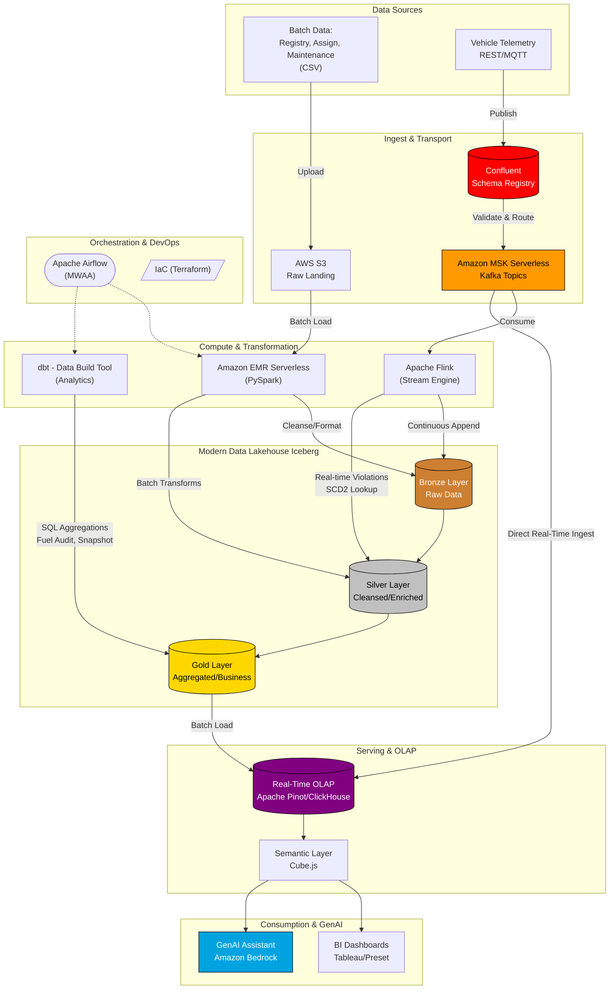

# OmniRoute: Modern Data Lakehouse Architecture Deep Dive

## Introduction
The OmniRoute Smart Logistics Engine represents a profound paradigm shift from traditional Lambda and Kappa processing frameworks into a highly unified, state-of-the-art Modern Data Lakehouse. This document provides a granular, minute-by-minute breakdown of the entire data ecosystem. Every single component, arrow, and integration path in this architecture has been explicitly designed to handle high-throughput IoT logistics data while delivering sub-second analytics, strict data governance, and extreme decoupled scalability.

## 1. The Data Sources Layer
The architecture fundamentally splits data origination into two operational speeds to isolate high-throughput streams from bulk analytical loading:
* **Batch Data (Registry, Assignments, Maintenance via CSV)**: Legacy ERP systems and human-in-the-loop operational processes regularly drop structured CSVs. These are highly structured, dense datasets where low latency is secondary to structural correctness. 
* **Vehicle Telemetry (REST/MQTT)**: High-frequency IoT sensors installed on hundreds of thousands of active logistics vehicles transmit geospatial data, velocities, and engine status globally, creating massive, unbounded JSON data streams.

## 2. Ingestion & Transport Layer
The arrows originating from Data Sources represent the first structural optimization layer:
* **AWS S3 Raw Landing**: The CSV files land directly into a segregated Raw S3 bucket. S3 is utilized because it is incredibly cheap, historically durable, and seamlessly triggers downstream event-based orchestration workflows (e.g., via AWS EventBridge to Airflow).
* **Confluent Schema Registry**: Unlike standard traditional architectures where raw JSON is dumped blindly into Kafka and later cleaned (causing expensive compute overhead), we employ a strict "Shift-Left" data quality philosophy. Every single IoT payload published by a vehicle must functionally conform to an Avro or Protobuf contract enforced at the boundary by the Schema Registry.
    * *Why this and not standard validation?* If an IoT sensor bugs out and sends malformed data arrays instead of floats, it is forcefully rejected at the protocol layer. This completely prevents "poison pills" from cascading, failing your data contracts, and crashing downstream consumer infrastructure.
* **Amazon MSK Serverless (Kafka Topics)**: Validated telemetry is routed here. Serverless MSK corresponds to the Kafka broker. Serverless is explicitly chosen over self-hosted EC2 Kafka clusters because managing Kafka partition balancing, replication, and Zookeeper node maintenance requires dedicated administrative overhead. MSK Serverless automatically scales up IO capacity dynamically during peak fleet delivery hours and scales down at night without manual, risky intervention.

## 3. Storage Layer: The Modern Data Lakehouse (Apache Iceberg)
The core physical storage layer spans scalable S3 droplets unified under **Apache Iceberg**, rigidly separated into the Medallion architecture:
* **Bronze**: An exact, append-only raw replication of the streaming and batch ingestions.
* **Silver**: Deduplicated, cleaned, enriched datasets with complex data-type castings.
* **Gold**: Aggregated business metrics, fuel audits, and rate calculation tables primed for BI tools.
* *Why Iceberg and not standard Parquet?* While Parquet is an excellent columnar format, it inherently lacks atomic transaction metadata. By adopting Iceberg, the Flink streaming engine can continuously inject thousands of rows of real-time `safety_violations` into S3, while a PySpark cluster simultaneously runs a massive 45-minute aggregation query on the exact same table. There are absolutely no read/write locking conflicts, and no dirty reads occur. It effectively grants full ACID enterprise database compliance to standard cloud storage buckets.

## 4. Compute & Transformation Layer
This layer is the operational engine where raw logistics data transforms into actionable intelligence:
* **Amazon EMR Serverless (PySpark)**: Handles massive batch ETL pipelines. It reads the raw S3 CSVs, transforms them into the Bronze Iceberg tables, performs intense memory-heavy joins (such as recalculating the SCD Type 2 asset history), and writes to the Silver layer. 
* **Apache Flink**: Continually subscribes and consumes from MSK. Flink is natively built for stateful, unbounded event stream processing. As telemetry streams in, an arrow points from Flink to the Silver layer (`SCD2 Lookup`): Flink requires knowing exactly *who* is driving the vehicle at that specific millisecond to issue a safety strike. It performs a sub-second, low-latency look-up into the Silver tables to resolve the driver, detects speeding/geofence intrusions in real time, increments the driver's strike state, and seamlessly applies penalty business logic.
    * *Why Flink and not Spark Structured Streaming?* Spark Streaming operates on "Micro-batches," which introduces inherent latency spikes (seconds to minutes). Flink processes data truly event-by-event, ensuring the sub-second latency essential for life-threatening safety alerts.
* **dbt (Data Build Tool)**: Orchestrates the heavy lifting for all Gold table aggregations. Rather than deploying highly technical PySpark Scala to calculate monthly fuel efficiency totals, dbt cleanly compiles standard SQL macros into robust execution plans. This democratization enables Data Analysts to dictate and maintain critical logistics business rules directly via SQL.

## 5. Real-Time Serving & OLAP
* **Apache Pinot or ClickHouse**: Serving as the real-time analytics warehouse.
    * *Why this instead of PostgreSQL / Redshift?* In our diagram, MSK flows *directly* into Pinot. If we used PostgreSQL, its internal B-Tree indexing mechanisms would choke and deadlock under the massive, sustained write concurrency generated by Flink events. Redshift is stellar for deep batch analysis but drastically fails at delivering sub-second queries on continually auto-refreshing user dashboards. Pinot and ClickHouse act as optimal bridges: efficiently ingesting streaming events directly from Kafka for real-time visibility, while seamlessly back-filling historical context from the Gold Iceberg tables.

## 6. Consumption & GenAI Layer
* **Cube.js (Semantic Layer)**: Consumes data from the OLAP engine and standardizes business metric logic. This ensures that whether a Tableau dashboard is visually querying it or an AI model is dissecting it, complex definitions like "Daily Safety Deviation Metrics" mean analytically identical things to every requester.
* **Generative AI (Amazon Bedrock)**: We empower Compliance Officers to "chat" directly with raw fleet telemetry. Because data logic is completely unified within the Semantic Layer, an LLM easily translates human text into exact, optimized SQL syntax. Those queries are routed via Cube to Pinot, yielding profound real-time actionable insights via human language.

## 7. Orchestration & DevOps
* **Apache Airflow (MWAA)**: The master temporal conductor. As shown via the dashed arrows to Spark and DBT, Airflow oversees schedule-based execution dependencies. While the fast-path stream (MSK to Flink to Pinot) functions ceaselessly (24/7), Airflow enforces strict rules: it absolutely prevents the dbt Gold aggregation models from triggering until it verifies that the EMR PySpark pipelines have firmly closed yesterday's Silver asset history partitions.
* **Terraform**: Underpins everything. Strict Infrastructure-as-Code (IaC) guarantees the entire intricate architecture map is completely version-controlled, auditable, and instantly reproducible across Sandbox, Staging, and Production AWS environments, eliminating any manual or "shadow" AWS Console manipulations.

---
## Architecture Visual Blueprint

Below is the definitive visual representation (Mermaid render and SVG embedded) covering the intricate integration points of the OmniRoute pipeline.

