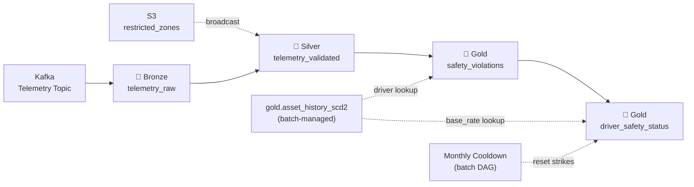

# OmniRoute — Streaming Pipeline Design

## 1. Overview

The streaming pipeline processes real-time vehicle telemetry from a self-managed Kafka cluster on EC2, detecting safety violations (speeding and restricted-zone breaches) and maintaining a running driver penalty ledger. It complements the batch pipeline documented in [medallion_architecture.md](./medallion_architecture.md).

**Key decisions:**
- **Compute:** Spark Structured Streaming on EMR (EC2)
- **Source:** Self-managed Kafka on EC2
- **Sink:** S3 (Parquet/Delta) for all layers
- **Micro-batch interval:** 30 seconds
- **State store:** S3-backed Delta tables for strike counts (swappable to DynamoDB/Redis later)



### Relationship to Batch Pipeline

| Concern | Batch Pipeline | Streaming Pipeline |
|---|---|---|
| Data sources | S3 CSVs (registry, assignment, fuel, maintenance) | Kafka JSON (telemetry) |
| SCD2 asset history | **Owns** — builds and maintains | **Reads** — joins to resolve current driver |
| Safety violations | — | **Owns** — detects and writes |
| Driver safety status | Monthly cooldown resets strikes | **Owns** — increments strikes in real-time |
| Orchestration | Airflow DAGs (daily/monthly/yearly) | Airflow DAG (continuous) + EMR long-running job |

---

## 2. Data Source — Kafka Telemetry Stream

### Topic Configuration

| Setting | Value |
|---|---|
| Topic name | `omniroute.telemetry.raw` |
| Partitions | 6 (keyed by `vin` for ordering per vehicle) |
| Replication factor | 2 |
| Retention | 7 days |
| Message format | JSON |

### Message Schema

```json
{
  "vin": "1HGBH225",
  "driver_id": "DRV_902",
  "speed": 115,
  "lat": 28.6139,
  "long": 77.2090
}
```

| Field | Type | Description |
|---|---|---|
| `vin` | String | Vehicle Identification Number |
| `driver_id` | String | Driver currently operating the vehicle |
| `speed` | Integer | Current speed in km/h |
| `lat` | Float | GPS latitude |
| `long` | Float | GPS longitude |
| `event_timestamp` | Kafka Timestamp | Automatically attached by producer; used as event time |

### Consumer Configuration

| Parameter | Value | Rationale |
|---|---|---|
| `kafka.bootstrap.servers` | EC2 private IP(s) from `.env` | Self-managed cluster |
| `subscribe` | `omniroute.telemetry.raw` | Single topic |
| `startingOffsets` | `latest` | Process only new events on first start; checkpoints handle restarts |
| `failOnDataLoss` | `false` | Tolerate Kafka log compaction / retention expiry |
| `maxOffsetsPerTrigger` | `10000` | Back-pressure: cap records per micro-batch |

---

## 3. Reference Data — Restricted Zones

- **Source:** `s3://ttn-de-bootcamp-bronze-us-east-1/poc-bootcamp-group5-bronze/ingested/restricted_zones/`
- **Format:** Parquet (ingested from `restricted_zones.json` by ad-hoc batch job)
- **Size:** Small (tens of rows) — loaded as a **broadcast variable**

| Column | Type |
|---|---|
| `zone_name` | STRING |
| `min_lat` | FLOAT |
| `max_lat` | FLOAT |
| `min_long` | FLOAT |
| `max_long` | FLOAT |

**Refresh strategy:** The restricted zones DataFrame is read once at job startup and broadcast-joined in each micro-batch. To pick up zone changes without restarting the streaming job, the driver re-reads and re-broadcasts the zones DataFrame every **100 micro-batches** (~50 minutes at 30s intervals).

---

## 4. Bronze Layer — Telemetry Ingestion

**Purpose:** Consume raw Kafka JSON, parse into a structured DataFrame, and persist as partitioned Parquet for auditability and replay.

### Input / Output

| | Details |
|---|---|
| **Input** | Kafka topic `omniroute.telemetry.raw` |
| **Output** | `s3://ttn-de-bootcamp-bronze-us-east-1/poc-bootcamp-group5-bronze/ingested/telemetry_raw/` |
| **Partitioning** | `dt=YYYY-MM-DD/hour=HH` (derived from `event_timestamp`) |
| **Write mode** | Append |
| **Checkpoint** | `s3://ttn-de-bootcamp-bronze-us-east-1/poc-bootcamp-group5-bronze/checkpoints/telemetry_raw/` |

### Schema (Output)

| Column | Type | Source |
|---|---|---|
| `vin` | STRING | Kafka JSON |
| `driver_id` | STRING | Kafka JSON |
| `speed` | INT | Kafka JSON |
| `lat` | FLOAT | Kafka JSON |
| `long` | FLOAT | Kafka JSON |
| `event_timestamp` | TIMESTAMP | Kafka message timestamp |

### Processing Logic (Pseudocode)

```python
# Read from Kafka
raw_stream = (
    spark.readStream
    .format("kafka")
    .option("kafka.bootstrap.servers", KAFKA_BOOTSTRAP)
    .option("subscribe", "omniroute.telemetry.raw")
    .option("startingOffsets", "latest")
    .option("maxOffsetsPerTrigger", 10000)
    .load()
)

# Parse JSON payload
telemetry_schema = StructType([
    StructField("vin", StringType()),
    StructField("driver_id", StringType()),
    StructField("speed", IntegerType()),
    StructField("lat", FloatType()),
    StructField("long", FloatType()),
])

parsed = (
    raw_stream
    .select(
        from_json(col("value").cast("string"), telemetry_schema).alias("data"),
        col("timestamp").alias("event_timestamp"),
    )
    .select("data.*", "event_timestamp")
    .withColumn("dt", to_date("event_timestamp"))
    .withColumn("hour", hour("event_timestamp"))
)

# Write to Bronze
(
    parsed.writeStream
    .format("parquet")
    .partitionBy("dt", "hour")
    .option("path", BRONZE_TELEMETRY_PATH)
    .option("checkpointLocation", BRONZE_CHECKPOINT_PATH)
    .trigger(processingTime="30 seconds")
    .start()
)
```

> [!NOTE]
> The Bronze layer is a raw archive. No filtering, deduplication, or business logic is applied here.

---

## 5. Silver Layer — Telemetry Validation & Flagging

**Purpose:** Clean raw telemetry, flag speeding events and restricted-zone breaches, and produce a violation-ready stream.

### Input / Output

| | Details |
|---|---|
| **Input** | Bronze `telemetry_raw` (streaming read) |
| **Output** | `s3://ttn-de-bootcamp-silver-us-east-1/poc-bootcamp-group5-silver/silver.telemetry/` |
| **Write mode** | Append |
| **Checkpoint** | `s3://ttn-de-bootcamp-silver-us-east-1/poc-bootcamp-group5-silver/checkpoints/telemetry_validated/` |

### Output Schema

| Column | Type | Transformation |
|---|---|---|
| `vin` | STRING | — |
| `driver_id` | STRING | — |
| `speed` | INT | — |
| `lat` | FLOAT | — |
| `long` | FLOAT | — |
| `event_timestamp` | TIMESTAMP | — |
| `is_speeding` | BOOLEAN | `speed > 110` |
| `is_in_restricted_zone` | BOOLEAN | Geofence check against restricted zones |
| `is_violation` | BOOLEAN | `is_speeding OR is_in_restricted_zone` |

### Processing Logic

```python
# 1. Filter invalid records
validated = parsed.filter(
    col("vin").isNotNull()
    & col("lat").between(-90, 90)
    & col("long").between(-180, 180)
)

# 2. Flag speeding
validated = validated.withColumn("is_speeding", col("speed") > 110)

# 3. Broadcast join with restricted zones for geofence check
zones_df = spark.read.parquet(RESTRICTED_ZONES_PATH)
zones_broadcast = broadcast(zones_df)

validated = (
    validated
    .join(
        zones_broadcast,
        (col("lat").between(col("min_lat"), col("max_lat")))
        & (col("long").between(col("min_long"), col("max_long"))),
        "left",
    )
    .withColumn("is_in_restricted_zone", col("zone_name").isNotNull())
    .withColumn("is_violation", col("is_speeding") | col("is_in_restricted_zone"))
)

# 4. Write to Silver
(
    validated
    .select(
        "vin", "driver_id", "speed", "lat", "long",
        "event_timestamp", "is_speeding", "is_in_restricted_zone",
        "is_violation", "zone_name",
    )
    .writeStream
    .format("parquet")
    .option("path", SILVER_TELEMETRY_PATH)
    .option("checkpointLocation", SILVER_CHECKPOINT_PATH)
    .trigger(processingTime="30 seconds")
    .start()
)
```

---

## 6. Gold Layer — Safety Violations

**Purpose:** Filter violation events, resolve the current driver from the batch-managed SCD2 table, classify the violation type, and append to the violations log.

### Input / Output

| | Details |
|---|---|
| **Input** | `silver.telemetry_validated` WHERE `is_violation = TRUE` |
| **Join** | `gold.asset_history_scd2` ON `vin` WHERE `_is_current = TRUE` |
| **Output** | `s3://ttn-de-bootcamp-gold-us-east-1/poc-bootcamp-group5-gold/gold.safety_violations/` |
| **Write mode** | Append |
| **Checkpoint** | `s3://ttn-de-bootcamp-gold-us-east-1/poc-bootcamp-group5-gold/checkpoints/safety_violations/` |

### Output Schema

| Column | Type | Description |
|---|---|---|
| `violation_id` | STRING | UUID generated per event |
| `vin` | STRING | Vehicle involved |
| `driver_id` | STRING | Resolved from SCD2 (current assignment) |
| `speed` | INT | Speed at event |
| `lat` | FLOAT | Latitude |
| `long` | FLOAT | Longitude |
| `event_timestamp` | TIMESTAMP | When the violation occurred |
| `violation_type` | STRING | `SPEEDING`, `ZONE_BREACH`, or `BOTH` |
| `zone_name` | STRING / NULL | Restricted zone name if applicable |

> [!IMPORTANT]
> A single telemetry event that triggers **both** speeding and zone breach is recorded as **one violation** with `violation_type = 'BOTH'`. This counts as a single Safety Strike.

### Processing Logic

```python
# 1. Filter to violations only
violations = validated_stream.filter(col("is_violation") == True)

# 2. Read SCD2 table (batch-managed, read as static for stream-static join)
scd2 = (
    spark.read.parquet(GOLD_SCD2_PATH)
    .filter(col("_is_current") == True)
    .select("vin", col("driver_id").alias("scd2_driver_id"), "daily_rate")
)

# 3. Join to resolve current driver
violations = violations.join(broadcast(scd2), on="vin", how="left")

# 4. Classify violation type
violations = violations.withColumn(
    "violation_type",
    when(col("is_speeding") & col("is_in_restricted_zone"), "BOTH")
    .when(col("is_speeding"), "SPEEDING")
    .otherwise("ZONE_BREACH"),
).withColumn(
    "violation_id", expr("uuid()")
).withColumn(
    # Prefer SCD2-resolved driver; fall back to Kafka driver_id
    "driver_id", coalesce(col("scd2_driver_id"), col("driver_id"))
)

# 5. Write to Gold
(
    violations
    .select(
        "violation_id", "vin", "driver_id", "speed", "lat", "long",
        "event_timestamp", "violation_type", "zone_name",
    )
    .writeStream
    .format("parquet")
    .option("path", GOLD_VIOLATIONS_PATH)
    .option("checkpointLocation", GOLD_VIOLATIONS_CHECKPOINT)
    .trigger(processingTime="30 seconds")
    .start()
)
```

---

## 7. Gold Layer — Driver Safety Status

**Purpose:** Maintain a running ledger of driver strike counts and penalized rates. This is the target table for the monthly cooldown job.

### Output Schema

| Column | Type | Description |
|---|---|---|
| `driver_id` | STRING | Unique driver identifier |
| `base_rate` | FLOAT | Original daily rate (from SCD2 assignment) |
| `strike_count` | INT | Active month's cumulative strike count |
| `current_adjusted_rate` | FLOAT | `base_rate × (1 - 0.05 × strike_count)` |
| `status` | STRING | `ACTIVE` or `SUSPENDED` |
| `month` | STRING | Reporting month (`YYYY-MM`) |
| `last_updated` | TIMESTAMP | Last modification time |

### Processing Logic

```
ON each new violation in gold.safety_violations:
    1. Determine current month (YYYY-MM from event_timestamp)
    2. FIND driver in gold.driver_safety_status for current month
    3. IF found:
         strike_count += 1
    4. IF not found:
         INSERT new row with strike_count = 1, base_rate from SCD2
    5. current_adjusted_rate = base_rate × (1 - 0.05 × strike_count)
    6. IF strike_count >= 10:
         status = 'SUSPENDED'
    7. last_updated = current_timestamp()
```

> [!WARNING]
> **State Store:** Strike counts are currently stored in an S3-backed Delta/Parquet table. This introduces read-after-write latency (~30–60 seconds). If sub-second penalty lookups are needed (e.g., for a driver-facing dashboard), swap this for **DynamoDB or Redis** as the primary state store, flushing to S3 periodically. The `foreachBatch` pattern below makes this swap straightforward.

### Implementation (foreachBatch Pattern)

Because driver safety status requires **read-modify-write** semantics (increment strikes), this stage uses `foreachBatch` rather than a pure streaming sink:

```python
def update_driver_safety(batch_df, batch_id):
    """
    Called once per micro-batch. Aggregates new violations,
    merges with existing driver_safety_status table.
    """
    if batch_df.isEmpty():
        return

    current_month = batch_df.select(
        date_format("event_timestamp", "yyyy-MM").alias("month")
    ).first()["month"]

    # Aggregate new strikes per driver in this micro-batch
    new_strikes = (
        batch_df
        .groupBy("driver_id")
        .agg(
            count("*").alias("new_strike_count"),
            max("event_timestamp").alias("last_violation_ts"),
        )
    )

    # Read existing status table (or create empty if first run)
    # ── NOTE: This is the S3-backed state store. ──
    # ── To swap for DynamoDB/Redis, replace this read/write block. ──
    try:
        existing = spark.read.parquet(GOLD_DRIVER_SAFETY_PATH).filter(
            col("month") == current_month
        )
    except Exception:
        existing = spark.createDataFrame(
            [], schema=driver_safety_schema
        )

    # Read base rates from SCD2
    base_rates = (
        spark.read.parquet(GOLD_SCD2_PATH)
        .filter(col("_is_current") == True)
        .select("driver_id", col("daily_rate").alias("base_rate"))
    )

    # Merge: join new strikes with existing, compute updated values
    merged = (
        new_strikes
        .join(existing, on="driver_id", how="full_outer")
        .join(base_rates, on="driver_id", how="left")
        .withColumn(
            "strike_count",
            coalesce(col("strike_count"), lit(0)) + coalesce(col("new_strike_count"), lit(0)),
        )
        .withColumn(
            "current_adjusted_rate",
            col("base_rate") * (1 - 0.05 * col("strike_count")),
        )
        .withColumn(
            "status",
            when(col("strike_count") >= 10, "SUSPENDED").otherwise("ACTIVE"),
        )
        .withColumn("month", lit(current_month))
        .withColumn("last_updated", current_timestamp())
        .select(
            "driver_id", "base_rate", "strike_count",
            "current_adjusted_rate", "status", "month", "last_updated",
        )
    )

    # ── Write back to S3 (overwrite current month partition) ──
    # ── SWAP POINT: Replace with DynamoDB/Redis put_item calls ──
    merged.write.mode("overwrite").partitionBy("month").parquet(
        GOLD_DRIVER_SAFETY_PATH
    )

# Wire into the violations stream
(
    violations_stream
    .writeStream
    .foreachBatch(update_driver_safety)
    .option("checkpointLocation", GOLD_DRIVER_SAFETY_CHECKPOINT)
    .trigger(processingTime="30 seconds")
    .start()
)
```

### Interaction with Monthly Cooldown (Batch)

The monthly cooldown job (`omniroute_monthly_cooldown` DAG) runs on the **1st of each month at 05:00 UTC** and modifies this same table:

```
FOR all drivers WHERE status != 'SUSPENDED':
    strike_count = 0
    current_adjusted_rate = base_rate
    status = 'ACTIVE'
```

> [!CAUTION]
> Suspended drivers (≥ 10 strikes) are **excluded** from the monthly cooldown. Their strikes and penalized rate persist until manual intervention.

---

## 8. Penalty System — Worked Examples

### Example A: First Strike

| Step | driver_id | base_rate | strike_count | current_adjusted_rate | status |
|---|---|---|---|---|---|
| Before | DRV-A | 500 | 0 | 500 | ACTIVE |
| After 1st violation | DRV-A | 500 | 1 | 475 | ACTIVE |

> Deduction = 5% × $500 = $25. The `base_rate` column is never modified.

### Example B: Suspension at 10 Strikes

| Step | driver_id | strike_count | current_adjusted_rate | status |
|---|---|---|---|---|
| 9th strike | DRV-C | 9 | 275 | ACTIVE |
| 10th strike | DRV-C | 10 | 250 | **SUSPENDED** |

> At strike 10, status flips to `SUSPENDED`. Driver is removed from active fleet.

### Example C: Monthly Cooldown

| Driver | Strikes (May 31) | Status | After June 1 Cooldown |
|---|---|---|---|
| DRV-B | 3 | ACTIVE | Strikes → 0, rate → base_rate ✓ |
| DRV-C | 10 | SUSPENDED | **No change** — excluded from cooldown ✗ |

---

## 9. State Management & Checkpointing

### Checkpoint Locations

| Stage | Checkpoint Path |
|---|---|
| Bronze ingestion | `s3://.../poc-bootcamp-group5-bronze/checkpoints/telemetry_raw/` |
| Silver validation | `s3://.../poc-bootcamp-group5-silver/checkpoints/telemetry_validated/` |
| Gold violations | `s3://.../poc-bootcamp-group5-gold/checkpoints/safety_violations/` |
| Gold driver safety | `s3://.../poc-bootcamp-group5-gold/checkpoints/driver_safety_status/` |

### Streaming Configuration

| Parameter | Value | Rationale |
|---|---|---|
| Trigger | `processingTime="30 seconds"` | Balance between latency and cost; violations detected within ~30s |
| Output mode (Bronze/Silver/Violations) | `append` | Immutable event logs |
| Output mode (Driver Safety) | `foreachBatch` with overwrite per month-partition | Read-modify-write semantics |
| Kafka offset tracking | Managed by Spark checkpoints | Exactly-once with idempotent sinks |

### Exactly-Once Guarantees

1. **Kafka → Bronze:** Spark checkpoints track Kafka offsets. On restart, processing resumes from the last committed offset.
2. **Silver → Gold (Violations):** Append-only Parquet with checkpoint ensures no duplicates.
3. **Driver Safety (foreachBatch):** Overwrite-by-partition is idempotent — replaying a micro-batch produces the same result.

---

## 10. Technology Stack & Deployment

| Component | Technology | Notes |
|---|---|---|
| **Stream source** | Self-managed Apache Kafka on EC2 | Cluster managed separately; bootstrap servers in `.env` |
| **Compute** | Amazon EMR (EC2 mode) | Spark Structured Streaming; long-running EMR step |
| **Storage** | S3 (Parquet) | All layers — Bronze, Silver, Gold |
| **Orchestration** | Apache Airflow | DAG triggers and monitors the EMR step |
| **IAM** | `SSM-Role-TTN-Bootcamp-2026-Role` | Same role as batch Glue jobs |
| **Monitoring** | CloudWatch + Spark UI | EMR exposes Spark UI on port 18080 |

### EMR Cluster Configuration

| Setting | Recommended Value |
|---|---|
| EMR release | `emr-7.0.0` (Spark 3.5+) |
| Master node | `m5.xlarge` (4 vCPU, 16 GB) |
| Core nodes | 2× `m5.xlarge` |
| Applications | Spark |
| Spark packages | `org.apache.spark:spark-sql-kafka-0-10_2.12:3.5.0` |
| Step type | Spark application (long-running) |
| Auto-termination | Disabled (streaming is continuous) |
| Log destination | `s3://.../emr-logs/` |

### spark-submit Command

```bash
spark-submit \
  --master yarn \
  --deploy-mode cluster \
  --packages org.apache.spark:spark-sql-kafka-0-10_2.12:3.5.0 \
  --conf spark.sql.streaming.schemaInference=true \
  --conf spark.streaming.stopGracefullyOnShutdown=true \
  s3://ttn-de-bootcamp-bronze-us-east-1/poc-bootcamp-group5-bronze/emr-scripts/streaming_telemetry_pipeline.py \
  --kafka-bootstrap "$KAFKA_BOOTSTRAP_SERVERS" \
  --bronze-path "s3://ttn-de-bootcamp-bronze-us-east-1/poc-bootcamp-group5-bronze/ingested/telemetry_raw/" \
  --silver-path "s3://ttn-de-bootcamp-silver-us-east-1/poc-bootcamp-group5-silver/silver.telemetry/" \
  --gold-violations-path "s3://ttn-de-bootcamp-gold-us-east-1/poc-bootcamp-group5-gold/gold.safety_violations/" \
  --gold-driver-safety-path "s3://ttn-de-bootcamp-gold-us-east-1/poc-bootcamp-group5-gold/gold.driver_safety_status/" \
  --scd2-path "s3://ttn-de-bootcamp-gold-us-east-1/poc-bootcamp-group5-gold/gold.asset_history_scd2/" \
  --restricted-zones-path "s3://ttn-de-bootcamp-bronze-us-east-1/poc-bootcamp-group5-bronze/ingested/restricted_zones/"
```

---

## 11. S3 Path Additions

The following paths need to be added to [s3_paths.json](file:///home/aryan-thapliyal/Desktop/omniroute/config/s3_paths.json):

```json
{
  "gold": {
    "tables": {
      "safety_violations": "s3://ttn-de-bootcamp-gold-us-east-1/poc-bootcamp-group5-gold/gold.safety_violations/",
      "driver_safety_status": "s3://ttn-de-bootcamp-gold-us-east-1/poc-bootcamp-group5-gold/gold.driver_safety_status/"
    }
  },
  "streaming": {
    "description": "Streaming pipeline checkpoint and script paths",
    "checkpoints": {
      "telemetry_raw": "s3://ttn-de-bootcamp-bronze-us-east-1/poc-bootcamp-group5-bronze/checkpoints/telemetry_raw/",
      "telemetry_validated": "s3://ttn-de-bootcamp-silver-us-east-1/poc-bootcamp-group5-silver/checkpoints/telemetry_validated/",
      "safety_violations": "s3://ttn-de-bootcamp-gold-us-east-1/poc-bootcamp-group5-gold/checkpoints/safety_violations/",
      "driver_safety_status": "s3://ttn-de-bootcamp-gold-us-east-1/poc-bootcamp-group5-gold/checkpoints/driver_safety_status/"
    },
    "emr_script": "s3://ttn-de-bootcamp-bronze-us-east-1/poc-bootcamp-group5-bronze/emr-scripts/streaming_telemetry_pipeline.py",
    "kafka": {
      "bootstrap_servers": "<EC2_PRIVATE_IP>:9092",
      "topic": "omniroute.telemetry.raw"
    }
  }
}
```

---

## 12. Airflow DAG Design

**DAG:** `omniroute_streaming` — manages the EMR streaming step lifecycle.

```mermaid
flowchart LR
    subgraph "omniroute_streaming (continuous)"
        A["Create/Get EMR Cluster"] --> B["Submit Spark Step"]
        B --> C["Monitor Step\n(EmrStepSensor)"]
        C -->|step failed| D["Alert & Retry"]
        C -->|step succeeded\n(graceful shutdown)| E["End"]
    end

    subgraph "omniroute_monthly_cooldown (1st @ 05:00 UTC)"
        MC1["Reset Driver Strikes"] --> MC2["Rate Deduction Report"]
    end

    B -.->|writes to| GDS["gold.driver_safety_status"]
    MC1 -.->|resets| GDS
```

### DAG Configuration

| Setting | Value |
|---|---|
| `dag_id` | `omniroute_streaming` |
| `schedule` | `@once` (manually triggered; streaming is long-running) |
| `start_date` | `2026-04-01` |
| `catchup` | `False` |
| `max_active_runs` | `1` |
| `tags` | `["streaming", "safety", "emr"]` |

### Tasks

1. **`create_emr_cluster`** — Uses `EmrCreateJobFlowOperator` to spin up the EMR cluster (if not already running).
2. **`submit_streaming_step`** — Uses `EmrAddStepsOperator` to submit the `spark-submit` command as an EMR step.
3. **`monitor_step`** — Uses `EmrStepSensor` to poll step status. For a streaming job, this sensor will only trigger if the step exits (crash or graceful shutdown).
4. **`terminate_cluster`** — Optional cleanup task (only if the cluster is purpose-built for streaming).

---

## 13. Idempotency & Fault Tolerance

| Scenario | Guarantee | Mechanism |
|---|---|---|
| Streaming job restart | No duplicate events processed | Spark checkpoint resumes from last committed Kafka offset |
| foreachBatch replay | Same result on re-execution | Overwrite-by-partition is idempotent |
| Monthly cooldown restart | No double-reset | Filter `WHERE status != 'SUSPENDED'`; upsert keyed on `(driver_id, month)` |
| SCD2 join staleness | Eventual consistency | Static SCD2 snapshot refreshed each micro-batch; worst-case delay = 30s + batch pipeline lag |
| Kafka data loss (retention expiry) | Tolerated | `failOnDataLoss=false`; lost events won't be replayed but won't crash the job |

### Graceful Shutdown

To safely stop the streaming job without data loss:

```bash
# On EMR master node
yarn application -kill <application_id>
```

Spark's `stopGracefullyOnShutdown=true` ensures the current micro-batch completes and checkpoints are committed before exit.

---

## 14. Monitoring & Alerting

### EMR / Spark Metrics

| Metric | Source | Alert Threshold |
|---|---|---|
| Streaming query progress | Spark UI (port 18080) | Batch duration > 30s (falling behind) |
| Input rows/sec | StreamingQueryListener | Drop to 0 for > 5 min (Kafka issue) |
| EMR step status | CloudWatch / Airflow sensor | Step exits unexpectedly |
| S3 checkpoint age | S3 object metadata | Last modified > 10 min ago |

### Kafka Consumer Lag

| Metric | Tool | Alert Threshold |
|---|---|---|
| Consumer group lag | `kafka-consumer-groups.sh --describe` | Lag > 50,000 offsets |
| Topic throughput | Kafka JMX / CloudWatch | Messages/sec drops below baseline |

### Airflow Callbacks

The streaming DAG uses the same `on_failure_callback` pattern as existing batch DAGs:

```python
def on_failure_callback(context):
    ti = context["task_instance"]
    dag_id = context["dag"].dag_id
    print(
        f"🚨 FAILURE: {dag_id}.{ti.task_id} | "
        f"execution_date={context['execution_date']} | "
        f"log_url={ti.log_url}"
    )
```

---

## Appendix: Complete S3 Layout (Streaming Additions)

```
s3://ttn-de-bootcamp-bronze-us-east-1/poc-bootcamp-group5-bronze/
├── ingested/
│   ├── telemetry_raw/dt=2026-04-15/hour=06/     ← Bronze (streaming)
│   └── restricted_zones/                         ← Reference data
├── checkpoints/
│   └── telemetry_raw/                            ← Bronze checkpoint
└── emr-scripts/
    └── streaming_telemetry_pipeline.py           ← EMR Spark script

s3://ttn-de-bootcamp-silver-us-east-1/poc-bootcamp-group5-silver/
├── silver.telemetry/                             ← Silver (streaming)
└── checkpoints/
    └── telemetry_validated/                      ← Silver checkpoint

s3://ttn-de-bootcamp-gold-us-east-1/poc-bootcamp-group5-gold/
├── gold.safety_violations/                       ← Gold (streaming)
├── gold.driver_safety_status/month=2026-04/      ← Gold (streaming + cooldown)
└── checkpoints/
    ├── safety_violations/                        ← Gold checkpoint
    └── driver_safety_status/                     ← Gold checkpoint
```

